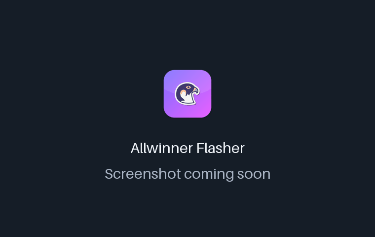
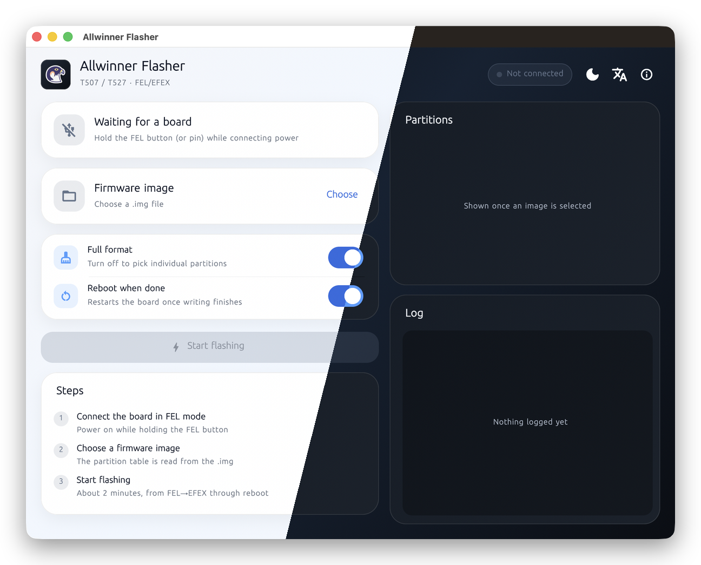
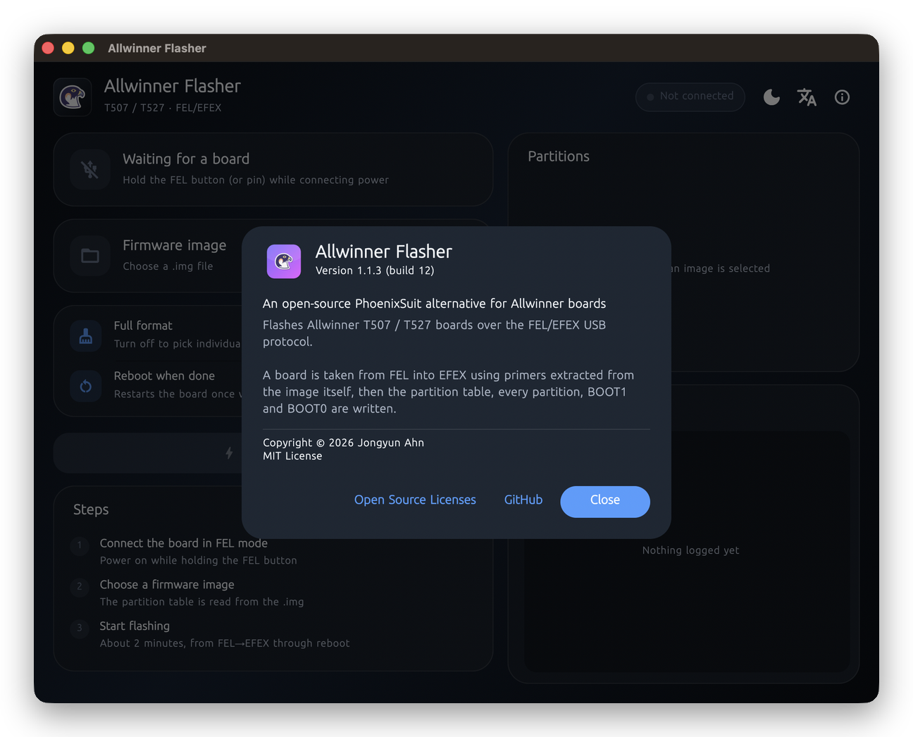

<!-- From jejezz/application-release-templates common/tool/readme @ conventions-v1.
     Generated by tool/readme/init_readme.py — see conventions/readme-guide.md.
     Fill every {{TODO: …}}; tool/readme/check_readme.py fails while any is left. -->

<p align="center">
  
</p>

<h1 align="center">Allwinner Flasher</h1>

<p align="center">
  A free, open-source <b>PhoenixSuit alternative</b> for flashing Allwinner T507 / T527 boards over FEL/EFEX USB — on macOS, Windows and Linux.
</p>

<p align="center">
  <a href="https://github.com/jejezz/allwinner-flashing-tool-macos/releases/latest"></a>
  <a href="https://github.com/jejezz/allwinner-flashing-tool-macos/releases"></a>
  
  
  <a href="LICENSE"></a>
</p>

<p align="center">
  <b>English</b> · <a href="README.ko.md">한국어</a>
</p>

<p align="center">
  
</p>

## Features

- **FEL to reboot in one pass** — takes the board from FEL into EFEX with primers extracted from the image itself, then writes the partition table, every partition, BOOT1 and BOOT0 (about 1 min 40 s for a 1.1 GB T527 image)
- **Keep what you want** — turn off full format and untick partitions (e.g. `userdata`); the confirmation lists exactly what stays
- **Progress you can read from across the bench** — overall and per-partition progress, a live log, and a window that turns purple while writing, green when done, red on failure
- **A CLI underneath** — `aw-tool` does everything the app does, with `--json` events for scripting
- **Light & dark, English & 한국어** — follows the system, or pick one in the toolbar

<p align="center">
  
  
</p>

## Install

Download from [**Releases**](https://github.com/jejezz/allwinner-flashing-tool-macos/releases/latest):

| OS | File |
|---|---|
| macOS 12.0+ (Apple Silicon) | `AllwinnerFlasher-<version>-macos-arm64.dmg` — open it and drag Allwinner Flasher to Applications |
| Windows 10/11 (x64) | `AllwinnerFlasher-<version>-windows-x64-setup.exe` |
| Linux (x64) | `AllwinnerFlasher-<version>-linux-x64.tar.gz` — extract and run `./install.sh` (`--remove` to uninstall) |

**Windows:** the installer isn't code-signed yet, so SmartScreen says "Windows protected your PC" — choose **More info → Run anyway**. Before the first flash, bind the board (VID `1f3a` / PID `efe8`, in FEL mode) to the **WinUSB** driver once with [Zadig](https://zadig.akeo.ie/) — otherwise the app never sees it. The troubleshoot button in the app's header walks through it.

**Linux:** needs `libusb-1.0-0` and a udev rule for access without `sudo` — see [USB driver](docs/aw-tool.en.md#usb-driver).

## How it works

The FEL/EFEX protocol is implemented from scratch in Rust (`aw-tool`, on libusb) and the Flutter app runs it as a **subprocess**, reading its NDJSON events. USB transfers can genuinely hang — a bad command once left a board stuck until the transfer timed out — and a separate process turns that into a clean kill, which is also how Stop works. The research behind it is in [docs/T527-T507-FEL-EFEX-기술조사.md](docs/T527-T507-FEL-EFEX-기술조사.md) (Korean).

## Development

The Flutter app lives in `gui/`, the Rust CLI at the repository root. The app finds `target/release/aw-tool` on its own when run from the checkout:

```bash
cargo build --release
cd gui
flutter pub get
flutter run -d macos
```

Needs a Rust toolchain and libusb (`brew install libusb` on macOS; Windows builds it with `--features vendored`). CLI usage, platform build scripts, the USB driver setup, what has been verified on hardware and the source layout: [docs/aw-tool.en.md](docs/aw-tool.en.md). Release CI: [docs/release-ci.md](docs/release-ci.md).

Releasing: `scripts/bump-version.sh patch`, merge, then tag `vX.Y.Z` — CI builds and publishes every platform. Rules: [application-release-templates/conventions](https://github.com/jejezz/application-release-templates/tree/main/conventions).

## Credits

- Font: [SeoulNamsan](https://www.seoul.go.kr/seoul/font.do) (Seoul Metropolitan Government)
- Icons: [Icons8](https://icons8.com)
- USB: [libusb](https://libusb.info) (LGPL-2.1)

## License

[MIT](LICENSE) © 2026 Jongyun Ahn
