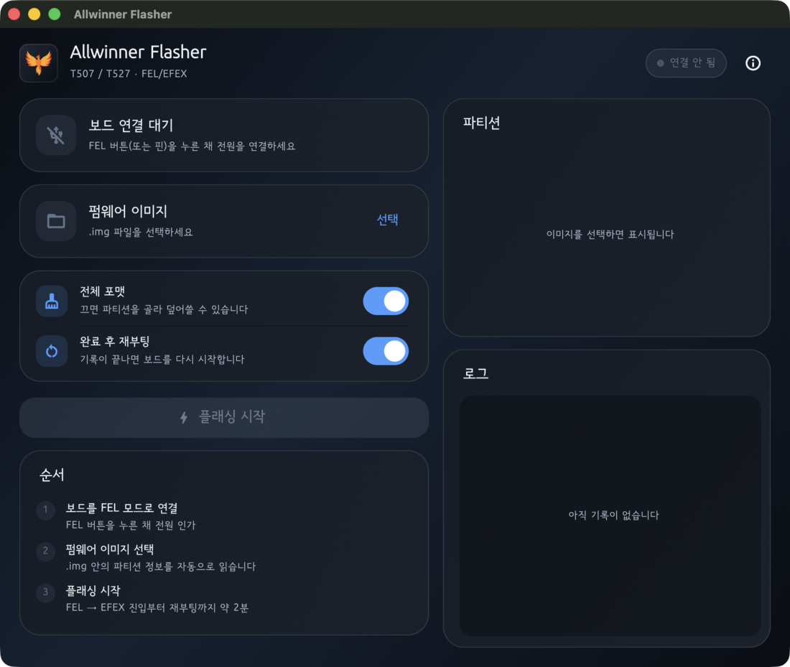
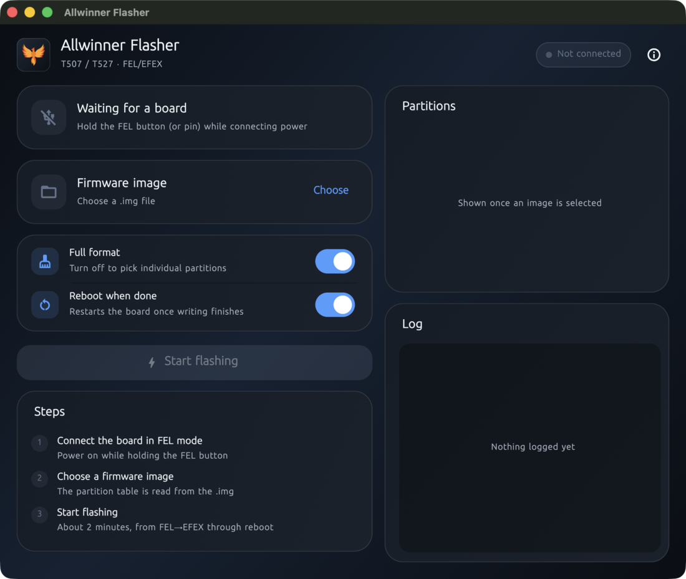

# aw-tool

[English](README.en.md)

Allwinner T507/T527 보드를 **macOS에서** 플래싱하는 도구. 벤더 도구인 PhoenixSuit이 Windows 전용이라, FEL/EFEX USB 프로토콜을 직접 구현해 대체한다.

CLI와 GUI 두 가지로 쓸 수 있다. FEL 모드에 들어간 보드에 명령 하나를 실행하면 부트스트랩부터 전체 퓨징, 재부팅까지 끝난다.

```bash
aw-tool flash-all firmware.img sys_partition.fex --reboot
```

| | |
|---|---|
| `aw-tool` (Rust) | CLI. 프로토콜 구현 전체가 여기 있다 |
| `gui/` (Flutter) | macOS 앱. CLI를 서브프로세스로 실행하고 진행률을 표시한다 |



시스템 언어에 따라 한국어와 영어를 지원한다.



## 상태

**CLI**

| 항목 | 상태 |
|---|---|
| T527 (sun55iw3 / A523) 전체 플래싱 → Android 정상 부팅 | 실기 검증 완료 |
| 검증한 이미지 | `pluto_lobby`, `pluto_wallpad` 2종 |
| 소요 시간 | 약 1분 40초 (부트스트랩 + 약 1.1 GB 기록 + 재부팅) |
| T507 | **미검증** — 아래 "T507로 옮길 때" 참조 |
| 저장 매체 | eMMC/SD(`storage type = 2`)에서 검증. NAND 미검증 |
| `--json` 이벤트 · `probe` · 종료 코드 | 오프라인 명령으로 검증 (`gui/test/aw_tool_integration_test.dart`가 실제 바이너리를 구동) |

**GUI**

| 항목 | 상태 |
|---|---|
| 빌드 · 실행 · 번들된 helper 사용 | 확인 (릴리즈 `.app`, Homebrew 링크 0) |
| GUI로 T527 전체 플래싱 성공 | 실기 검증 완료 (2026-09-07) |
| 장치 감지 · 이미지 선택 · 진행률 · 완료 화면 | 위 플래싱 과정에서 확인 |
| 실패 화면 | **실기 미검증** |
| 중단 버튼 | **실기 미검증** |
| 파티션 골라 쓰기 (체크박스 / `--skip`) | **실기 미검증** — CLI 필터링과 가드는 실제 이미지로 오프라인 확인 |

미검증 항목은 모두 실제로 그 상황을 만들어야 도달한다(중단, 실패, 선택 기록). 선택 기능의 CLI 쪽은 실제 wallpad 이미지로 파티션 12개 → 10개 필터링과 세 가지 거부 조건(전체 포맷과 병용, 이름 오타, `--only`/`--skip` 동시 사용)을 확인했다.

## 요구 사항

- macOS, Apple Silicon (앱은 arm64 전용)
- Rust 툴체인 (1.98로 빌드 확인)
- libusb — `brew install libusb` (배포용 빌드에는 불필요, 아래 참조)
- GUI를 빌드할 경우 Flutter (3.47.1로 확인)

USB 접근에 `sudo`는 필요 없다.

## 빌드

```bash
cargo build --release
# 산출물: target/release/aw-tool
```

다른 맥으로 배포할 바이너리(예: GUI `.app` 번들에 동봉)는 libusb를 정적 링크해야 합니다. 기본 빌드는 Homebrew의 `libusb-1.0.0.dylib`을 동적 링크하므로 libusb가 없는 머신에서 실행되지 않습니다.

```bash
cargo build --release --features vendored
```

`vendored`는 libusb를 소스에서 함께 빌드합니다. 결과 바이너리는 macOS 시스템 프레임워크(CoreFoundation, IOKit, Security, libSystem, libiconv)만 링크합니다.

## 사용법

### 1. 보드를 FEL 모드로

FEL 버튼/핀을 누른 채 전원을 연결한다. 확인:

```bash
aw-tool fel-version
# AWUSBFEX soc=00001890(A523) ...
```

### 2. 파티션 스펙 꺼내기

`sys_partition.fex`는 이미지 안에 들어 있다.

```bash
aw-tool extract firmware.img sys_partition.fex --out sys_partition.fex
aw-tool list-partitions sys_partition.fex     # 오프라인 확인 (하드웨어 불필요)
```

### 3. 플래싱

```bash
aw-tool flash-all firmware.img sys_partition.fex --reboot
```

FEL 상태면 자동으로 EFEX까지 진입한다. 이미 EFEX면 그 단계를 건너뛴다.

```
bootstrap: FEL device found (soc_id=0x1890)
bootstrap: fes1 running at 0x4c000 (47264 bytes), initialising DRAM...
bootstrap: u-boot running at 0x4a000000 (950272 bytes), waiting for EFEX...
bootstrap: EFEX mode reached
[1] flash_set_on OK
[2] erase_flag=1 OK
[3] MBR OK
[4.1/12] partition 'bootloader_a' OK (16129024 bytes, raw)
...
[4.6/12] partition 'super' OK (1021182504 bytes, sparse -> 3584 MB expanded, 977 MB written)
...
[8] reboot triggered
```

주요 옵션:

| 옵션 | 뜻 |
|---|---|
| `--reboot` | 완료 후 재부팅 |
| `--erase-flag 0` | 전체 포맷 대신 덮어쓰기만 |
| `--skip env_a,misc` | 해당 파티션은 건드리지 않음 (`--erase-flag 0` 필요) |
| `--only super,boot_a` | 해당 파티션만 기록 (`--erase-flag 0` 필요) |
| `--boot0-item boot0_nand.fex` | NAND 보드용 BOOT0 선택 (기본값은 `boot0_sdcard.fex`) |
| `--skip-larger-than <bytes>` | 큰 파티션 건너뛰기 (부분 테스트용) |
| `--no-bootstrap` | 자동 FEL→EFEX 진입 끄기 |

### 파티션 골라 쓰기

보드가 스스로 바꿔 놓은 파티션(`env_a`, `misc` 등)을 남긴 채 나머지만 갱신할 때 쓴다.

```bash
aw-tool flash-all firmware.img sys_partition.fex --erase-flag 0 --skip env_a,misc --reboot
```

```
keeping 'env_a' (not selected)
keeping 'misc' (not selected)
plan: MBR(65536 B) + 10 partitions (1017 MB total) + BOOT1(1376256 B) + BOOT0(69632 B)
      선택된 파티션만 기록: bootloader_a, boot_a, vendor_boot_a, ...
```

**`--erase-flag 0`이 반드시 필요하며, 없으면 명령이 거부된다.** 전체 포맷(`erase_flag=1`)은 기록 전에 모든 파티션을 지우므로, 빼놓은 파티션은 보존되는 게 아니라 **빈 채로 남는다.** 보존 의도와 정반대 결과라 조합 자체를 막았다.

`sys_partition.fex`에 없는 이름을 주면 에러가 나고 알려진 이름 목록을 보여준다. 조용히 무시하면 `--skip env`(실제 이름은 `env_a`) 같은 오타가 바로 지키려던 파티션을 덮어쓰게 된다.

MBR / BOOT0 / BOOT1은 선택과 무관하게 항상 기록된다. 사용자 데이터가 아니라 펌웨어에 속하는 영역이다.

## 명령 목록

**이미지 다루기 (오프라인)**

| 명령 | 설명 |
|---|---|
| `list` | IMAGEWTY 이미지의 아이템 목록 |
| `extract` | 아이템 하나 꺼내기 |
| `list-partitions` | `sys_partition.fex`의 파티션별 시작 섹터 계산 |
| `patch-workmode` | `work_mode` 패치 + 체크섬 재계산 |

**장치 상태 확인**

| 명령 | 설명 |
|---|---|
| `probe` | 지금 연결된 것이 `fel` / `efex` / `none` 중 무엇인지 한 번에 보고 |
| `fel-version` | FEL 모드인지, 어떤 SoC인지 |
| `efex-verify-dev` | EFEX 모드인지 |
| `efex-query-storage` | 부팅한 저장 매체 종류 (BOOT0 변종 선택에 사용) |

`probe`는 장치가 없어도 종료 코드 0으로 `none`을 보고합니다. 연결 대기 중 폴링하는 용도라 "없음"이 정상 상태이기 때문입니다.

**플래싱 (파괴적)**

| 명령 | 설명 |
|---|---|
| `bootstrap` | FEL → EFEX 진입만 |
| `flash-all` | 전체 퓨징 — **주 사용 명령** |
| `flash-partition` | 파티션 하나만 |
| `flash-mbr` / `flash-boot1` / `flash-boot0` | 개별 대상 기록 |
| `flash-set-erase-flag` | erase 플래그 설정 |

> `flash-*` 명령은 장치 내용을 지운다. 되돌릴 수 없다.

## GUI

`gui/`의 Flutter macOS 앱. 이미지를 고르면 파티션 목록을 미리 보여주고, 보드 연결을 감지해 플래싱 버튼을 활성화하며, 진행률과 로그를 표시한다.

화면 언어는 시스템 설정을 따르며 한국어와 영어를 지원한다. 한 앱만 다른 언어로 띄워 확인하려면:

```bash
defaults write com.europa.awflasher AppleLanguages -array en   # 되돌리기: defaults delete ...
```

**전체 포맷을 끄면 파티션 목록에 체크박스가 생긴다.** 체크를 해제한 파티션은 그대로 남는다(위 "파티션 골라 쓰기" 참조). 전체 포맷 모드에서는 체크박스가 잠기고 모두 기록된다 — 포맷은 어차피 전부 지우기 때문이다. 확인 대화상자가 유지할 파티션 이름을 그대로 보여주므로 실행 전에 확인할 수 있다.

```bash
./scripts/build-app.sh
# 산출물: gui/build/macos/Build/Products/Release/Allwinner Flasher.app (약 37 MB)
```

이 스크립트가 하는 일: `--features vendored`로 helper 빌드 → Homebrew 링크가 남았는지 검사 → Flutter 릴리즈 빌드 → helper를 `Contents/Resources/`에 복사 → 재서명. 번들에 파일을 넣으면 Flutter가 만든 서명이 깨지고 macOS가 실행을 거부하므로 재서명이 필요하다.

개발 중에는 앱이 저장소의 `target/release/aw-tool`을 자동으로 찾으므로 그냥 실행하면 된다.

```bash
cargo build --release && cd gui && flutter run -d macos
```

**App Sandbox를 끈 상태다** (`macos/Runner/*.entitlements`). 사내 도구 전제이며, 샌드박스 안에서는 USB 접근에 `com.apple.security.device.usb` 엔타이틀먼트가 필요하고 번들된 helper도 샌드박스를 상속한다. 이 때문에 `file_picker`의 사전 검사도 통과하지 못해 `FilePicker.skipEntitlementsChecks()`를 호출한다. App Store 배포로 방향을 바꾸려면 이 세 가지를 함께 되돌려야 한다.

앱은 **Apple Silicon(arm64) 전용**이다. Flutter는 유니버설 바이너리를 만들 수 있지만 번들된 helper는 cargo가 호스트 아키텍처로만 빌드하므로, 유니버설 앱은 Intel 맥에서 실행은 되고 helper를 부르는 순간 실패한다. 아키텍처를 맞춰 두는 편이 정직하다(`gui/macos/Runner/Configs/Release.xcconfig`의 `ARCHS`). 유니버설로 바꾸려면 rustup을 설치하고(Homebrew 툴체인에는 x86_64 std가 없다) `rustup target add x86_64-apple-darwin` 후 두 벌을 `lipo -create`로 합치면 된다.

GUI는 CLI를 **서브프로세스로** 실행한다. FFI로 링크하지 않는 이유는 USB 전송이 실제로 멈출 수 있기 때문이다 — 잘못된 명령이 보드를 `INVALID direction` 상태로 만들고 전송이 타임아웃까지 걸린 적이 있다. 별도 프로세스면 그 hang은 kill로 끝나고, 취소도 프로세스 종료로 처리된다. 검증이 끝난 플래싱 경로를 GUI 작업이 건드리지 않는 이점도 있다.

## 릴리즈

```bash
./scripts/release.sh v0.1.0             # 빌드 → 패키징 → GitHub 릴리즈 초안
./scripts/release.sh v0.1.0 --publish   # 초안 대신 바로 공개
```

`dist/`에 세 개를 만든다.

| 산출물 | 내용 |
|---|---|
| `Allwinner-Flasher-<tag>-macos-arm64.zip` | 앱 (약 16 MB) |
| `aw-tool-<tag>-macos-arm64.tar.gz` | CLI 단독 |
| `SHA256SUMS` | 체크섬 |

스크립트는 워킹 트리가 깨끗한지 확인하고, helper 아키텍처를 검사하고, 압축을 푼 뒤 서명이 여전히 유효한지 검증한 다음 태그를 밀고 `gh release create`를 부른다.

`zip`이 아니라 `ditto -c -k --keepParent`를 쓴다. `zip(1)`은 번들의 심볼릭 링크와 확장 속성을 보존하지 못해 압축을 풀면 코드 서명이 깨진다.

### Gatekeeper

**이 앱은 Apple Developer ID로 서명·공증되지 않았다(ad-hoc 서명).** 내려받은 상태에서는 Gatekeeper가 실행을 막는다 — 실제로 확인했다:

```
$ spctl -a -vvv -t exec "Allwinner Flasher.app"
Allwinner Flasher.app: rejected
```

받는 쪽에서 첫 실행 전에 한 번 격리 속성을 지워야 한다.

```bash
xattr -dr com.apple.quarantine "/Applications/Allwinner Flasher.app"
```

제대로 공증하려면 Apple Developer Program(연 $99)에 가입해 Developer ID Application 인증서를 받고, `codesign --options runtime --timestamp`로 서명한 뒤 `notarytool submit --wait`과 `stapler staple`을 거쳐야 한다. 그때는 `build-app.sh`의 ad-hoc 서명(`--sign -`)을 인증서 이름으로 바꾸면 된다.

## GUI 연동 (`--json`)

모든 명령에 `--json`을 붙이면 산문 대신 **줄 단위 JSON**을 stdout으로 냅니다. 한 줄에 객체 하나, 각 객체에 `event` 키가 있습니다. GUI가 이 툴을 서브프로세스로 띄우고 stdout을 파싱하는 것을 전제로 한 출력입니다.

```
{"event":"step","step":"fel_found","message":"bootstrap: FEL device found (soc_id=0x1890)"}
{"event":"plan","partitions":12,"total_bytes":1150000000,"mbr_bytes":16384,...}
{"event":"partition_begin","index":6,"total":12,"name":"super","bytes":1021182504}
{"event":"progress","name":"super","written":104857600,"total":1024458752}
{"event":"partition_end","index":6,"total":12,"name":"super","format":"sparse","seconds":74.3}
{"event":"done"}
```

| 이벤트 | 용도 |
|---|---|
| `plan` | 진행바 전체 크기를 미리 잡을 수 있게 총 바이트 수를 먼저 알림 |
| `step` | 이름 붙은 단계 경계 (`fel_found`, `mbr`, `boot0`, `reboot` 등) |
| `partition_begin` / `partition_end` | 파티션 단위 경계 |
| `progress` | 파티션 **내부** 바이트 진행률 (100 ms 간격으로 스로틀) |
| `done` / `error` | 종료. `error`는 anyhow 컨텍스트 체인을 `causes` 배열로 함께 제공 |
| `probe`, `items`, `partitions` 등 | 조회 명령의 구조화된 결과 |

`progress`가 파티션 내부까지 내려가는 이유는 `super` 때문입니다. 약 1 GB를 64 KB 청크로 쓰기 때문에, 파티션 단위 이벤트만 있으면 전체 1분 40초 중 **1분 넘게 진행바가 한 칸에 멈춰** 있어 멈춘 것처럼 보입니다.

실패는 예외로 전파되지 않고 항상 마지막 줄의 `error` 이벤트로 나옵니다(종료 코드는 1). 프론트엔드가 stderr를 따로 파싱할 필요가 없습니다.

## 동작 방식

```
FEL (boot ROM)
  ├─ fes1.fex   (work_mode=0x10 패치) → 0x4C000 에 업로드·실행 → DRAM 초기화
  └─ u-boot.fex (work_mode=0x10 패치) → 0x4A000000 에 업로드·실행
       ↓ USB 재열거
EFEX
  ├─ erase 플래그 설정 → 파티션 전체 erase
  ├─ MBR/GPT 기록
  ├─ 파티션별 기록 (sparse 이미지는 확장하며 기록)
  ├─ BOOT1 (boot_package.fex) / BOOT0 (boot0_*.fex)
  └─ 재부팅
```

두 프라이머 모두 이미지에서 직접 꺼내 패치하므로 별도 파일 준비가 필요 없다. 외부 `sunxi-tools` 의존도 없다.

## 알아둘 점

**`super.fex`는 raw 이미지가 아니다.** Android sparse 컨테이너(매직 `0xED26FF3A`)라 확장해서 기록해야 한다. 그대로 쓰면 파티션 선두에 liblp 메타데이터 대신 sparse 헤더가 놓여, 커널은 부팅하지만 first-stage init이 dynamic partition을 찾지 못하고 마운트 전에 bootloader로 재부팅한다. 툴이 매직으로 자동 판별하지만, 새 파티션을 다룰 때는 파일명이 파티션 이름과 같더라도 컨테이너 여부를 먼저 확인할 것.

**주소 공간이 두 가지다.** 파티션 오프셋은 `addrlo` 공간과 GPT LBA 공간 두 가지로 표기되며 항상 `0xa000` 섹터(20 MB) 차이가 난다.

- `sys_partition.fex`와 이 툴의 섹터 인자 → **addrlo 공간** (예: super `0x90400`)
- U-Boot 셸의 `mmc read` / `part list` → **GPT LBA 공간** (예: super `0x9a400`)

실기를 덤프해 비교할 때 이 둘을 섞으면 엉뚱한 결론이 나온다.

**프라이머와 기록본은 다르다.** `work_mode`를 패치한 fes1/u-boot는 DRAM에만 올라가는 프라이머다. 저장소에 기록하는 BOOT0/BOOT1은 반드시 패치하지 않은 원본이어야 한다.

## T507로 옮길 때

파이프라인 자체는 공통이지만 아래는 SoC별로 다르므로 해당 SDK에서 다시 확인해야 한다.

- **프라이머 로드 주소** — T527은 fes1 `0x4C000`, u-boot `0x4A000000`. 근거는 `include/configs/<soc>.h`의 `CONFIG_FES1_RUN_ADDR`, `fes/fes1.lds`, `u-boot.lds` / `.config`의 `CONFIG_SYS_TEXT_BASE`. `--fes1-addr` / `--uboot-addr`로 지정할 수 있다.
  > 잘못된 주소(예: `sunxi-fel spl`이 가정하는 boot0용 `0x44000`)로 fes1을 올리면 보드가 응답하지 않는다. 전원 재인가로 복구된다.
- **BOOT0 변종** — `efex-query-storage`로 매체를 확인해 `boot0_sdcard.fex` / `boot0_nand.fex` 선택.

## 크레딧

앱 아이콘: [Icons8](https://icons8.com). 무료 라이선스는 출처 표기를 요구하므로 README와 앱의 About 대화상자 양쪽에 넣었다. 원본은 `assets/icon-source.png`이며, `scripts/make-icon.sh`가 앱 테마 색의 라운드 스퀘어에 올려 아이콘 세트를 만든다.

## 문서

조사 과정 전체 — 프로토콜 근거(벤더 소스 위치), 실기 로그, 검증 방법, **배제한 가설들** — 은 [`docs/T527-T507-FEL-EFEX-기술조사.md`](docs/T527-T507-FEL-EFEX-기술조사.md)에 있다. 새 SoC 대응이나 이상 동작을 쫓을 때 먼저 볼 것.

## 구성

| 파일 | 역할 |
|---|---|
| `src/imagewty.rs` | IMAGEWTY 컨테이너 파서 |
| `src/sunxi_head.rs` | `work_mode` 패치(offset 224) + `mksunxiboot` 체크섬 |
| `src/fel.rs` | FEL USB 프로토콜 |
| `src/efex.rs` | EFEX 프로토콜 (벤더 `usb_efex.h`/`.c` 기반) |
| `src/bootstrap.rs` | FEL→EFEX 자동 진입 |
| `src/sparse.rs` | Android sparse 이미지 파서 |
| `src/sys_partition.rs` | `sys_partition.fex` 파서 + 오프셋 계산 |
| `src/event.rs` | 진행 리포터 (산문 / NDJSON 양쪽) |
| `gui/lib/aw_tool.dart` | CLI 실행 + JSON 이벤트 파싱 |
| `gui/lib/flasher_model.dart` | 장치 폴링, 이미지 로딩, 플래싱 상태 |
| `gui/lib/main.dart` | UI |
| `gui/lib/l10n/*.arb` | 한국어 · 영어 문자열 (generated 파일은 커밋하지 않음) |
| `gui/lib/about.dart` | About 대화상자 |
| `scripts/build-app.sh` | `.app` 빌드 + helper 동봉 + 재서명 |
| `scripts/release.sh` | 릴리즈 패키징 + GitHub 게시 |
| `scripts/make-icon.sh` | 아이콘 세트 생성 |
